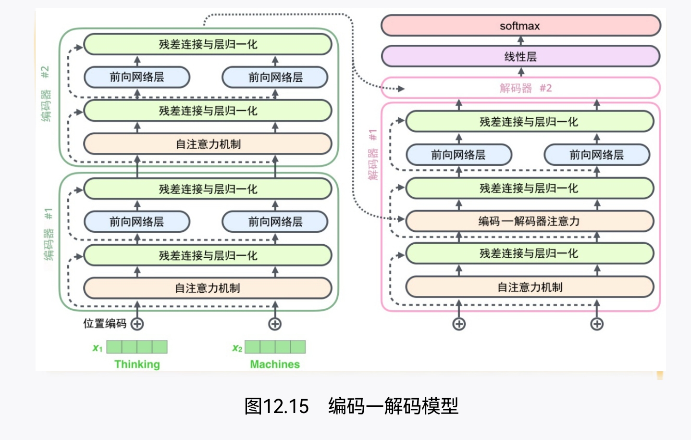

- [[计算机视觉中的Transformer]]
- **Transformer的本质**
	- 
%%[🖋 Edit in Excalidraw](attachments/Transformer%202023-01-05%2016.35.29.excalidraw.md), and the [dark exported image](attachments/Transformer%202023-01-05%2016.35.29.excalidraw.dark.svg)%%
- **编码解码模型**
	- 
	- 
- **Positional Encoding**
	- Positional Encoding就是句子中词语相对位置的编码，让Transformer保留词语的位置信息
	- %%[🖋 Edit in Excalidraw](attachments/Transformer%202023-01-05%2016.42.45.excalidraw.md), and the [dark exported image](attachments/Transformer%202023-01-05%2016.42.45.excalidraw.dark.svg)%%
	- 
%%[🖋 Edit in Excalidraw](attachments/Transformer%202023-01-05%2016.50.47.excalidraw.md), and the [dark exported image](attachments/Transformer%202023-01-05%2016.50.47.excalidraw.dark.svg)%%