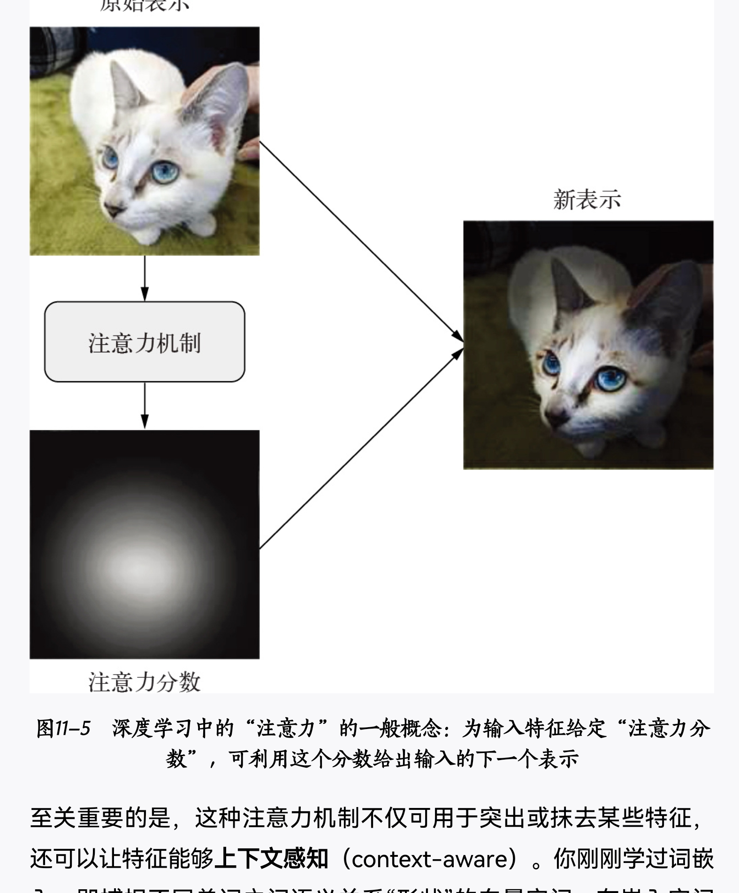

- 什么是注意力机制
	- 注意力机制可以理解为，计算机视觉系统在模拟人类视觉系统中可以迅速高效地关注到重点区域的特性
	- 如何理解计算机视觉中的注意力机制？ - 电光幻影炼金术的回答 - 知乎 https://www.zhihu.com/question/485458547/answer/2143274837
- **注意力机制的分类**
	- [[全局attention和部分attention]]
	- 
- **计算机视觉中为什么需要Attention**
	- CNN本身有一个缺陷，每次操作只能关注到卷积核附近的信息（local information），==不能融合远处的信息==（non-local information)。而attention可以把远处的信息也帮忙加权融合进来，起一个辅助作用。
	- 
- **视觉注意力机制的分类**
	- 
%%[🖋 Edit in Excalidraw](attachments/%E6%B3%A8%E6%84%8F%E5%8A%9B%E6%9C%BA%E5%88%B6%202023-01-05%2016.33.38.excalidraw.md), and the [dark exported image](attachments/%E6%B3%A8%E6%84%8F%E5%8A%9B%E6%9C%BA%E5%88%B6%202023-01-05%2016.33.38.excalidraw.dark.svg)%%
- **完全基于attention的结构**-Transformer
	- [Transformer](Transformer.md)
	- [[计算机视觉中的Transformer]]
- **Attention辅助GNN**
	- [[Attention机制下的GNN]]

