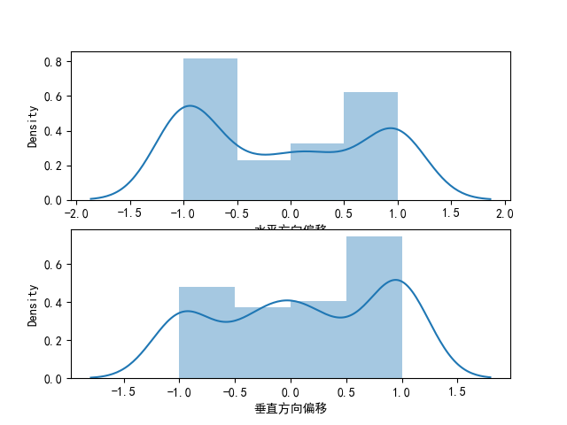

### 传统算法 Lucas-Kanade
Lucas-Kanade 方法计算稀疏特征集的光流
OpenCV提供了另一种算法来查找密集的光流。它计算帧中所有点的光流。它基于Gunnar Farneback的算法，

此前选取的是角点检测出的点进行光流
现在选取盲道的点,尝试进行行走方向的判定
[#002 高级计算机视觉 - 光流运动估计 (datahacker.rs)](https://datahacker.rs/002-advanced-computer-vision-motion-estimation-with-optical-flow/)
## 转为鸟瞰图
还是需要转为鸟瞰图,否则图片中物体的移动方向与实际的移动方向有较大差距,即近处移动明显,远处移动不明显
## 人的行走方向

人有哪行走方向?
左转,
分块,统计
```
1920*1280分割成4*4的16个480*320的小块
考虑到行走过程中像素点的移动可能会偏离图像区域,只选取中间3*3的区域进行光流判断


```
## 特征点的选取
去除横向或纵向移动太大的点
选取距离人更近的点,
- 角点检测的goodFeaturesToTrack
- 盲道正中心的+-100像素,间隔10
- 盲道正中心的+-200像素,间隔20
- 多块,全局均分
- 多块,选取更具标志性的特征点,障碍物,盲道,goodFeaturesToTrack,
- 人行走中心线上的物体的移动,其他位置的移动太不确定

如下图所示计算光流向量与横轴的夹角，并把计算的夹角结果分配到各自的区间（这里面每30度定义一个区间），统计数量（本例中没有计算加权，应用场景和光流数量有关）。 可以得到长度为12的特征向量。 这里面我按逆时针从小到大定义的，可以按照自己的需要进行不同区域的定义。


## 完全直线场景
### 使用全局角点检测的点
将偏移统一进行归一化--那种x,y的方式有问题,还得是tan

### 遮挡除了盲道的图
一个奇怪的现象,我遮挡了盲道周围的背景后识别不出盲道来

