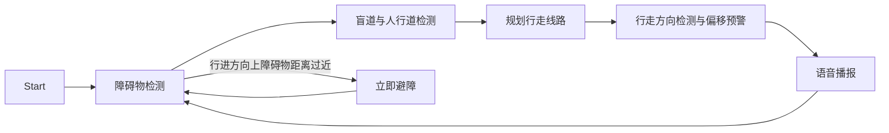

[toc]

# 当前的任务


# 摘要

近年来,计算机视觉技术领域取得了长足的进展,在目标检测、语义分割等方向都有大量出彩的技术出现,同时计算机视觉技术的落地与应用也愈发重要.本项目聚焦我国的视觉障碍人群,利用语义分割,光流等计算机视觉技术,构建基于双目相机的盲人户外智能语音辅助系统,帮助盲人更加安全便捷地进行户外行走.

首先,项目研究了室外语音辅助系统的搭建与实现,第一步构建手机终端程序,作用是采集定位信息与方位朝向信息.第二步构建服务端,运行盲道分割与偏移判断,障碍物检测与避障等核心代码,最后通过蓝牙耳机对用户进行偏离警示.

之后,对感知与规划过程进行了重点研究.利用自建盲道人行道数据集,通过轻量级实时语义分割网络bisenetv2,进行训练,实现了对盲道与人行道的像素级语义分割.

盲道人行道走向

盲道偏移

障碍物检测与路径规划


# 核心功能

视障人士出行时得以选择安全且正确的行走路线,能够在语音的引导下走上盲道同时避开途中的障碍物,当遇到需穿过马路情景时能够引导用户在斑马线上通过马路,最终到达正确目的地。

本系统的核心技术难点在于感知,规划,决策,控制四个方面,其中重点与难点在于感知与规划.

以下是本系统的运行流程




# 感知

感知周围环境是系统最为重要的一环.对于盲人用户而言,环境中的两种信息是其最为关注的,一是环境中的盲道与人行道等道路标识线,二是前进方向上的障碍物.

## 感知道路标识线

本系统的核心宗旨是让盲人尽可能的走在安全的地方,而盲道与人行道作为相对更加安全的区域是我们所提倡前往的,因此对于盲道与人行道的感知不能够仅仅停留在检测的程度,还需要进行进一步的语义分割,提取延伸方向,与抽象化区域等工作.

最终需要感知到的信息包括如下:

1.  盲道与人行道的走向
    
2.  盲道与人行道的可行走区域(以一或多个闭包的形式表示)
    
3.  盲道起点与用户当前所处位置的角度与距离
    

此处主要使用相机获取的RGB图像信息.
进行规范化描述即为:
```
input:predicted_img

output:
blind_road_find=1//是否发现盲道
blind_road_distance=0.5m//盲道与使用者的距离
blind_road_angle=-30°//盲道在使用者的左边30度角位置
on_blind_road=1//使用者是否位于盲道上
blind_road_departure//使用者是否正在偏离盲道

sideways_find=1//是否发现人行道
sideways_distance=3.5m//人行道与使用者的距离
sideways_angle=30°//人行道在使用者的右边30度角位置
on_sideways=1//使用者是否位于人行道上
sideways_departure//使用者是否正在偏离人行道

```

### 语义分割

盲道与人行道作为特征较为明显的两类道路标识线,在输入图像较为清晰,背景环境简单,样本类型单一的情况下,利用二值化,canny边缘检测等传统图像处理算法能够取得较为良好的分割效果,且分割速度极快,但由于现实环境复杂多变,相机防抖的缺失,盲道种类繁多等原因,利用深度学习技术进行语义分割更加适宜本项目的需求.

由于目前大多数盲路和人行横道分割方法所使用的数据集主要强调了盲道或人行横道的特征，而忽略了环境影响,我们从真实环境中收集背景更复杂的图像，并用语义标签将数据集标记为盲路和人行道。

我们的数据集包括868张打标签的 512 × 512的图像,其中包含盲道标签的图像612张,包含人行道标签的图像412张,训练集:验证集:测试集=7:2:1,在正式训练前,采用了数据增强技术,对数据进行随机垂直与水平翻转,随机图像截取,随机图像模糊等处理.

本文分别采用deeplabv3+与bisenetv2进行训练,由于bisenetv2拥有更好的实时性,本项目最终选用bisenetv2.

数据集示例如下


#### (1)训练细节

训练时的批大小设置为4,学习率设置为0.005,迭代70轮.总体来说,loss收敛良好,在验证集上miou达到0.9182,Kappa一致性检验值为0.936,一致性较好.


#### (2)结果

在验证集上miou达到0.9182

|        | 准确率(acc) | 交互比(iou) | f1-score |
| ------ | ----------- | ----------- | -------- |
| 背景   | 0.98997     | 0.9828      | 0.9913   |
| 盲道   | 0.96316     | 0.9177      | 0.9571   |
| 人行道 | 0.93299     | 0.8536      | 0.921    |

在实际测试的推理过程中,每张图片平均预测用时约250ms,能大致满足


#### (3)可视化结果

在盲路和人行横道测试集上的一些可视化

##### 盲道效果


##### 人行道


### 盲道与人行道走向获取

为什么要获取走向?

由于要平衡"走安全的路"与"走便捷的路"两种决策,为避免走安全的路却走在错误的方向的情况出现,需要获取盲道与人行道的走向,以实现行走大方向的不偏移.

由于语义分割后的结果是像素级别的分割,需要进行进一步分析出更多抽象化特征.

#### 人行道走向获取

随机一致采样性(RANSAC)算法 

人行道检测存在以下典型应用场景:


[面向视障出行辅助的视觉感知技术研究]一文中主要研究了利用自适应分割与一致性分析,但未对人行道的走向分析与区域抽象化进行研究.

我们采用如下区域进行区域与走向的提取方式:

```python
Input:
	语义分割预测结果图像

Algorithm:
    初始化阈值bw_height,bw_width;
	处理图像,过滤出只有人行道的二值图;
	对图像进行侵蚀处理;
	对此二值图像提取轮廓列表contours;
	for contour in contours:
        获取轮廓contour最小外接矩形box;
        如果 box.高>bw_height 或 box.宽>bw_width:
            box[0]加入left_line列表;            
            box[2]加入right_line列表
	RANSAC算法;
               
```

1. 处理图像,过滤出只有人行道的二值图
2. 对图像进行侵蚀处理
3. 对此二值图像提取轮廓
4. 遍历每个轮廓,如果


#### 盲道走向获取

##### 霍夫直线

盲道会转弯,直线经常检测不出来

##### 尝试


#### 一些尝试

通过传统图像处理与ransac获取人行道走向


### 角度与距离获取

测距与测角的原理如下图:


本系统采用的是双目相机类型是Realsense D415,其视场角$\theta$为69.4度,采集图像的像素为1280*720,令X=1280,p的位置为(x,y)

1. 计算距离d米远处的相机的真实可测水平长度 $L=2*d*tan(/ 2)$ 
2. 计算实际中点 p 到相机视角正前方方向的垂直距离 $l=(X/2-x)*L/X$
3. 根据d与l计算目标的距离$d_{x},\theta_{x}$   


### 盲道偏离检测

利用当前行走朝向与盲道/人行道走向判定

关于盲道

## 感知障碍物

在复杂现实场景中,盲人出行所面临有动态障碍物与静态障碍物两种障碍物类型.本项目中主要研究的是对静态障碍物的检测.

最终需要感知到的信息如下:
1.  障碍物的轮廓
    
2.  障碍物与用户当前所处位置的角度与距离

进行规范化描述即为:
```perl6
input:

rgb_img,depth_img/ply格式点云,care_meter

output:

obs_all_find=1   //care_meter距离内是否发现障碍物

obs_front_find=1   //care_meter距离内行走正前方是否发现障碍物

closest_obs_distance=0.5m  //最近的前方可能相碰障碍物与使用者的距离

closest_obs_angle=-10°  //最近的前方可能相碰障碍物与使用者的角度

obs_list  //障碍物列表,按照距离进行排序 每个障碍物包括属性如下{distance:2m,angle:40,width:100cm,height=30cm}

```

### 利用深度图

#### 算法步骤

算法步骤如下

1. 设定阈值
2. 图像获取与深度补全 :star:[bowenyang92/实感深感图像：处理来自实感摄像机的 rgb 和深度图像 (github.com)](https://github.com/bowenyang92/RealsenseDepthImage)
3. 形态学腐蚀膨胀
4. 边缘检测(canny算子与Sobel算子): 借鉴[[基于双目立体视觉的无人机避障算法研究 肖道文.]
5. 寻找轮廓列表
6. 聚类:获取所有轮廓的最小外接矩形,距离过远或没有检测数据则忽略,在设定阈值下合并矩形框
7. 质心坐标获取


#### 尝试

深度补全处理前,边缘过于分散


分割前景(速度极慢)


均值移位算法分割前景


### 利用点云

#### 尝试一

点云生成速度过慢,暂时放弃

https://github.com/IntelRealSense/librealsense/blob/master/wrappers/python/examples/export_ply_example.py
导出为ply格式点云,还没有试试速度


# 规划

最终的目的是到达终点,大方向与小方向的融合问题,

## 可行走区域的分级与总体行走策略

不可行走区域

可行走区域

建议行走区域(盲道,人行道)

## 与尺度地图融合问题(大方向)


安全性,便利性

一个情况:当盲道在旁边,目的地在对面时的应对

## 基于人工视场的避障方法

1.通过障碍物与盲道人行道信息生成当前局部地图

2.避障路线规划


问题:场景不断变化中,地图怎么构建与更新


# 决策与控制

提示什么信息.如何提示


