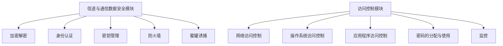
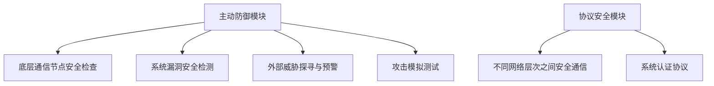
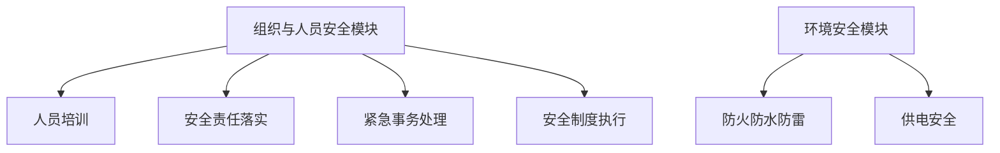

# 关于安全系统

## 安全系统的需求

自古以来,人们一直有着对构建安全的系统的需求.在互联网高度普及的今日,系统往往与网络紧紧关联,于此同时构建安全的系统也愈发困难。

用户往往希望构建安全的系统,并且希望系统在面对攻击、错误、灾难时依旧保持可靠性.然而现实社会中存在一些威胁系统安全的因素，一旦安全系统失效，小则威胁个人隐私，大则危害到整个人类的生活与环境。

## 系统安全威胁的类型

### 自然威胁

自然威胁主要指的是一些自然现象，这些现象是人为不可控制和避免的，比如雷暴天气产生的电磁干扰，会影响系统的稳定。尤其是一些极端恶劣天气，比如冰雹或者是台风，可能损坏户外系统设备，从而威胁整个系统的安全。

### 人为威胁

人为威胁指的是，人为故意或者无意对系统进行攻击，从而导致系统出现故障，不能正常运行，信息的安全性和保密性受到破坏，造成恶劣影响。人为威胁分为**主动威胁和被动威胁**两种。内部操作人员错误的操作属于被动威胁，主要是使用数据的方式和途径不正确和不规范，导致资源被误用。而主动威胁指一些不法分子(如网络黑客)对系统进行攻击，从而获取利益，这种威胁极为常见,不法分子常常利用黑客技术来对系统进行攻击，从而使安全系统失效。

### 系统威胁

系统威胁是指信息系统自身的设计、应用或连接存在问题，而对系统本身造成的威胁。如程序设计逻辑不合理，硬件质量不过硬等都是作为系统威胁影响着系统安全。

【【智能电网信息安全威胁及防御技术研究】】

# 网络攻击与安全系统

不同类型安全系统，既有共性又各有特性，其构建方式也略有不同。单纯抽象的通过对系统安全威胁进行分析而不结合实际案例分析欠缺实际意义，我们可以通过一些攻击事件来更加明确如果要构建一个安全的系统，哪些问题是更加值得关注的。

## 以乌克兰和以色列国家电网遭受网络攻击事件为例

### 背景知识

智能电网是一种典型的信息物理融合系统，由传统电力基础架构与信息基础架构共同组成。智能电网的安全问题包括**物理安全和信息安全**两个方面。智能电网信息化及其物理系统与信息系统的深度融合为其引入了新的安全隐患，针对信息系统的网络攻击在破坏其功能的同时，也会传导至物理系统并威胁其安全运行。近几年来，通过网络攻击智能电网并进行破坏的事件时有发生。

2015年12月23日，乌克兰电网遭遇突发停电事故，引起乌克兰西部地区约70万户居民家中停电数小时。事后研究人员表示，这是由 BlackEnergy（黑暗力量）恶意软件／代码导致的破坏性事件。在此次攻击事件中，运用了其最新版本 BlackEnergyLite，并增添了 KillDisk 组件和 SSH安全外壳协议）后门。KillDisk 组件用于删除计算机硬盘驱动器里的数据并**导致系统无法重启**。SSH 后门在获得 SSH 服务器的访问权限后，开放连接SSH 服务器的6789端口，从而**使攻击者可以永久访问或控制受感染的 SSH 服务器**。该停电事故被视为实际出现的首例针对供电系统的恶意行为。

2016年1月25日，以色列电力局遭受了一次严重的网络攻击。在此次攻击事件中攻击者**发送包含勒索软件的钓鱼邮件**给电力局工作人员，**诱骗电力局工作人员执行恶意代码**，并加密其电脑中的相关内容，需要电力局工作人员付款才能解锁。事发后，以色列当局被迫关闭了电力设施中被感染的计算机，以防止勒索软件在网络中进一步传播，引发更大的事故。

[*智能电网信息安全防御体系与...受网络攻击事件的思考与启示_李中伟.pdf](file:///D:/Edge_download/智能电网信息安全防御体系与...受网络攻击事件的思考与启示_李中伟.pdf)

### 攻击事件复盘

2015 年的网络攻击事件中，黑客运用了线上攻击和线下攻击2 种手段，同时对乌克兰电网主控系统、 SCADA 系统以及用户服务反馈系统进行攻击，结合乌克兰电网官方和相关安全组织披露的信息，整体攻击过程如图所示【[从乌克兰停电事故看电力信息系统安全问题_李保杰.pdf](file:///D:/Edge_download/从乌克兰停电事故看电力信息系统安全问题_李保杰.pdf)】：

#### 线上攻击

**隐藏在 Office 表格文件**（.xls 格式）中的预先设定的病毒**通过邮件**被定向发送至目标计算机，缺乏防范意识的**用户启动文件中的恶意宏设置**， BlackEnergy 木马通过 Rookit 驱动的释放和对系统关键进程（svchost.exe 和 main.dll）的注入开启本地网络端口并下载相应组件，利用认证漏洞以虚拟专用网（virtual private network ， VPN）从外网侵入目标工作站和服务器系统，通过 SSH 后门以 Https 协议建立与通信服务器间的联系。

通过对攻击残留痕迹的分析发现，早在事故发生前6 个月黑客便已侵入乌克兰电网系统。在潜伏期间，逐步盗取授权凭证，升级管控权限并在系统中横向渗透。当寻找到 SCADA 系统后，通过绕过身份认证和利用已盗取的权限，获得对 SCADA 的控制权。在特定时间，通过人机控制界面（human machine interface， HMI）对目标变电站**下达恶意指令使其跳闸**，继而引发递推式系统失稳。随后，攻击者在串行**接口网关设备植入恶意固件**以保证即使调度工作站的控制被恢复之后，对变电站的远程控制命令也无法传达。同时 KillDisk 组件攻击 SCADA 监视主机并使得其监控致盲，使得**工作人员丧失了对电网的实时监控能力**。

之后 KillDisk **清空系统日志**，永久粉碎、覆盖相关文件，导致关键数据实质性丢失，为安全机构事后分析设置障碍。

#### 线下攻击

利用**分布式拒绝服务（distributed denial of service， DDoS）**组件攻击乌克兰电网的电话服务系统，“洪流”式的自动拨号引发系统长时间阻塞，干扰工作人员对实际停电事故的掌握和维修工作的开展，以达到**最终延长停电时间的目的**。

### 网络攻击链

网络攻击链可分为2 个阶段：**侵入阶段和攻击阶段**，攻击者若要发动高水平的攻击需要遵循该模式的2 个阶段的步骤进行，同时目标系统的防御体系也可以在这些步骤中识别出黑客的进攻痕迹【汤涌．电力系统安全稳定综合防御体系框架[J]．电网技术，2012，36（8）：1－5．】

**阶段一:侵入阶段**：攻击者通过事先实地或者网络侦查等方式获取目标系统的组织结构和漏洞信息，随后选择恶意软件类型和载体，将其结合成攻击武器。通过定位信息的采集，利用**社会工程学手段**向目标系统无差别或者有针对性地投放。用户一旦上钩，恶意软件便被释放植入，一方面立足于被感染的工作站横向拓展渗透；另一方面**通过后门或者漏洞**建立与攻击者的通信联系，整个过程中不断收集凭证并**建立持久的访问连接**，为第二阶段的进攻做准备。

**阶段二：攻击阶段**：植入的恶意软件利用本地连接和凭证以高度自适应性在整个系统环境中发展，一方面**更改已有组件配置**以完成与配电管理系统的互动；另一方面**针对串联接口研制特定的破坏固件**。随后，在正式发动最终进攻前，专业的攻击者会对已控制的系统进行测试和评估。攻击时，攻击者运用本地软件获得**对基础设施的直接控制权**，通过修改运行参数或者直接摧毁系统以达到设施停运的目的。随后，在指令信道上植入研制出的特定固件以防止设施恢复，并利用相应组件清理系统日志，覆盖主引导扇区，擦除关键文件或是强制执行关机操作。

### 启示

本文于首节提到了三种系统安全威胁，通过前文的叙述，我们可以发现在本次事件中，正是系统威胁与人为威胁中的被动威胁与主动威胁**同时生效**导致了安全系统丧失可靠性。

我们可以从这一系列攻击事件的复盘与网络攻击链中得出些关于构建安全系统的启示:

- **安全系统应当对内部人员所造成的潜在威胁进行防范**。在这两次攻击中，乌克兰电网人员与以色列电力局人员**安全防范意识薄弱**直接导致了攻击的成功发起。在工作人员防范意识淡薄的情况下，乌克兰电网系统即没有实现办公管理大区与外部互联网的物理隔离，同时缺乏对恶意邮件的监控过滤功能，易被攻击者通过多样的社会工程攻击手段欺骗利用。人是信息系统中最不稳定、最不确定，也是最危险的因素；特别是**内部人员，是信息安全的最大威胁**。因此，需加强管理、制定完善的信息安全制度。
- **除了进行被动防御还有进行主动防御，应注重对系统的安全扫描**。乌克兰攻击事件中 BlackEnergy 软件早在6 个月前便已潜伏至配电子公司电网系统之中，然而在此期间乌克兰电网并没有通过专业技术手段去扫描系统。此外，事后对攻击痕迹的分析发现，在事故前2 天，攻击者启动了一次攻击模拟测试，遗憾的是在测试期间相关设备和控制系统的异常表现也未被检测到。
- **安全系统应注重自身漏洞的修复**。乌克兰电网信息安全系统**存在多个可被利用的开源漏洞**包括如远程终端设备 RTU 的部分基础设施的详细通信协议被供应商公开在网络之上，利用 VPN 从办公区网络进入工控系统网络的过程缺少对2 个关键因素的认证，以及现有的防火墙允许攻击者在系统外以远程管理员身份接入 ICS 网络等。
- **安全系统应注重对底层通信节点的安全检查**：系统中的一些物理设备在实现测量、保护、监控、通信等功能的同时，其本身作为底层通信节点，是系统通信网络的主要组成部分之一。黑客很有可能入侵并潜伏在这些物理设备中，在满足一定的触发条件时才开始执行恶意程序。这类攻击具有很深的**隐蔽性**，采用通用的入侵检测技术很难发现。黑客对这些设备的攻击效果一定会体现在某些物理特征上，可以通过发现这些设备在时间、空间和控制指令执行效果等方面的异常表现来检测这类攻击。在攻击乌克兰电网时攻击者便在串行**接口网关设备植入恶意固件**以保证即使调度工作站的控制被恢复之后，对变电站的远程控制命令也无法传达。
- **安全系统既需要物理隔离，又要重视传统物理隔离的缺点**。攻击乌克兰和以色列国家电网的病毒软件即是通过电子邮件传播，对于对安全性要求极高的系统，各个单位办公系统／网络应进行物理隔离，**并禁止Ｕ盘和移动硬盘等存储介质**在两个系统／网络之间交叉使用，禁止在电力监控计算机中打开办公文档或电子邮件。同时过去以保障封闭式空间为基础的物理隔离方法被广泛应用。依靠专用线路、实体围墙、出入身份认证、安保巡逻、摄像头等措施，直接接触式攻击的成本和难度大幅度提高，然而如今**无人值守终端的大量应用**已成为必然趋势，从成本角度不可能为每一个基础组建独立的网络，取而代之的往往是公共的信息传输通道。这些**孤立节点**可能因为本身就在内网之中而成为黑客攻击的突破口，而且一旦在孤点建立隐蔽、永久的通信通道，攻击者便可以**长期潜伏、渗透全局**。
- **网络攻击也能对系统造成重大的影响**。电力系统作为国家关键性基础设施已经成为网络攻击的重要目标，网络攻击能达到类似于物理攻击的效果，从而导致变电站乃至整个能源供给系统的瘫痪。
- **同一系统的多个子系统最好不使用相同配置**。一般来说，对于大范围无差别的 APT 攻击，其目标对象的选择会综合考虑以下几个因素：（1）对象是否使用相同的系统和配置；（2）对象是否对多路系统采用集中控制；（3）在防御体系中暴露的风险等级；（4）攻击持续时间的预估（长期或短期）。本次事故中，在乌克兰总共14 家区域配电子公司中只有上述的3 家被选择攻击的原因便可能是出于其在操作体系、系统漏洞、防御水平和服务范围等方面的相似性。

## 安全技术之外的事

### 关于定义安全

每当构建一个系统，首先应对对系统有着明确的定义比如**保护对象是谁**，银行系统的安全定义与医疗系统与电力系统可能有很大的不同。简单的评价系统安全是不符合实际的，很多系统宣称自己安全，而只是因为硬件而被认证为安全，但实际上可能忽略人为因素，这样的系统很难称为真正安全的系统。

从严格意义上讲，不存在绝对安全的网络，系统的安全和开放本身就是互相矛盾的。因此，需基于**“适度安全”和“尽可能透明”**的策略，明确系统的信息安全需求和为实现信息安全保障要求所增加的投入，在保证信息传输的可靠性、实时性前提下制定系统信息安全策略，定义信息的共享方式和安全级别，寻找信息安全和共享、信息传输实时性与系统安全性之间的平衡点，提出信息安全最佳实施方案。

**“适度安全”和“尽可能透明”**的策略显然还考虑到了用户的便利性，例如限制密码猜解次数其显然有着抗穷举攻击的优势，但对于普通用户而言，又有着被拒绝服务的风险，反而会给用户带来不便，如果系统所保护对象的价值微不足道，安全带来的成本甚至高于系统所保护的物品价值，如此安全系统也很难让人称赞。

### 社会工程攻击

电影《我是谁：没有绝对安全的系统》中将社会工程学看作伟大的欺骗艺术，其中提到“人究其本性极易受骗，也怕冲突”，利用人这两点特性可以攻破许多系统。系统常常不是被从系统安全层面上攻破，而是从人开始攻破。

正如同攻击者获取一般用户银行卡密码或支付密码的最有效方式是通过摄像头等偷看一样，无论系统设计的多么完备，如果不重视系统中的人的作用，攻击者依然可以绕过系统的防御，系统坚固的防御此时如同法国所修建的马奇诺防线一样在此时变得毫无用处。

人员是信息安全系统管理工作中稳定性最弱、风险性最高的因素，乌克兰和以色列国家电网遭受网络攻击事件均是从攻击者诱使内部人员的工作失误，打开钓鱼邮件开始，更加证明了这一点。因此加强对系统内部全体员工特别是关键岗位工作人员的信息安全工作显得尤为重要，通过对通用攻击模式的分析不难发现，攻击者往往利用员工的心理弱点、本能反应、好奇心、信任、贪婪等心理陷阱投放极其隐蔽的恶意软件并诱导激活，因此对员工的安全防范意识的培训需要针对各类攻击手段，结合不同工作岗位的性质和人员的心理素质水平来开展。

社会工程攻击包含如下定义：【５］ＭｉｔｎｉｃｋＫＤ，ＳｉｍｏｎＷＬ．入侵的艺术［Ｍ］．陈曙晖，译．北京：清华大学出版社，２００７：２３－３０】

- 社会工程目的：通过管理漏洞获取目标机密信息；
- 信息获取途径：一切可以承载机密信息的介质；
- 卡式战略目标管理模型：核心目的、里程碑、子目的；
- 信息收集：社会工程的前提条件，也是最关键的一步，信息的质量直接决定社会工程的成功率；
- 数据筛选：对比最终目的筛除冗余信息及无用信息，优化数据；
- 服从性分析：对比信息间相互联系和从属关系，解析最优路径；
- 身份伪造：通过欺骗、冒用等手段伪装成目标信任者；·建立信任：让受害者接纳，与系统信息对接；
- 社会攻击：利用一系列系统非结构性漏洞获取目标信息。

[基于目标管理的社会工程学模型研究_宋艾米(1).pdf](file:///D:/Edge_download/基于目标管理的社会工程学模型研究_宋艾米(1).pdf)假设与人为因素接触越多，社会工程获取的信息量就越多，由此渠道按人为因素的比重大小程度由小到大如下排列：

- 搜索引擎：直接检索公共区域有价信息；
- 垃圾搜寻：企业垃圾堆中废弃有价信息；
- 网络陷阱：利用社交网站等资料骗取密码等有价信息；
- 恶意邮件：添加病毒附件，利用好奇心获取有价信息；
- 电话攻击：使用电话通信冒充技术人员等骗取密码等有价信息；
- 正面潜入：冒充被允许进入公司人员或偷记密码，以进入公司进行攻击；
- 反向社会工程：暗中破坏后，毛遂自荐进行修复，获取信任及有价信息

面对如此的社会工程攻击，很难保证系统的完全安全，需要做好内外网的物理隔离、人员录用机制的审查、明确信息安全保密职责、终止离岗人员的系统访问权限等基础工作，才能尽可能的防止堡垒从内部攻破。

# 安全系统的构建

P2DR 模型源于美国 ISS 公司提出的自适应网络安全模型（Adaptive Network Security Model， ANSM），其在整体安全策略的控制和指导下，综合利用防护工具和检测工具了解、评估系统的安全状态，将系统调整到“最安全”和“风险最低”的状态。在此过程中，防护、检测和响应形成一个完整、动态的安全威胁响应闭环，在安全策略的整体指导下保证信息系统安全[1]。

IATF 是美国国家安全局（NSA）组织编写的一个全面描述信息安全保障体系的框架，它提出了信息保障时代信息基础设施的全套安全需求，其创造性在于：首次提出了信息保障依赖于人、操作和技术共同实现组织职能/业务运作的思想，人通过技术支持实施操作过程，最终实现信息保障目标；提出稳健的信息保障状态取决于信息保障的各项策略、过程、技术和机制，在整个组织信息基础设施的所有层面上都能得以实施[2]。

P2DR（Policy， Protection，Detection and Response）安全模型和 IATF 信息保障技术框架是信息安全体系发展的重要里程碑，奠定了信息安全体系逐步动态化、过程化的基础。[基于情景感知的信息安全主动防御体系建设_杨维永.pdf](file:///D:/Edge_download/基于情景感知的信息安全主动防御体系建设_杨维永.pdf)

网络攻击技术的不断更新使得网络安全问题日益严峻，特别是高级持续威胁（Advanced Persistent  Threat，APT）的出现，对网络安全防护提出了新的挑战。相较于其他攻击形式，APT 主要体现在攻击者实施攻击前需精确收集攻击对象的业务流程和目标系统信息。而在信息收集过程中，此攻击会主动挖掘攻击目标信息系统和应用的漏洞，并利用这些漏洞组建起攻击者所需的网络，进一步利用0day 漏洞进行攻击，从而达到终极攻击目的。

在这种情况下单纯的被动防御与主动防御都难以阻挡攻击，只有两者结合才有可能构建一个相对安全的系统。

## 被动防御技术

所谓被动防御技术就是，通过提前设计防御的规则来防御已知攻击手段的攻击。一般比较常用的被动防御技术有防火墙、身份认证技术、访问控制和入侵检测等。

### 防火墙技术

是一种计算机硬件、软件的结合技术，该技术就是在内部可信网络和外部非可信网络间建立一种屏障（安全网关），防止外部用户非法入侵内部网络。在软件系统中可配置防火墙，配置规则、端口、定义策略，保证各网络或服务间的可信安全。

### 身份认证/数字签名技术

身份认证是一个在计算机系统或网络中确定一个操作员身份的过程。如果该系统是由一个未知的用户操作，它可能是一个系统的安全问题，在信息系统中的身份验证是非常重要的。常用的身份认证方法有用户名密码、动态口令、短信验证码、生物特征认证等。身份认证
技术可保证操作者的真实物理身份与数字身份一一对应。

### 加密／解密技术

加密技术是最基本、最常用且最有效的信息安全防御技术，可以有效限制非法侦听、截获、中断、伪造的概率，从而达到保证报文／信息安全的目的。

### 入侵检测技术

系统需要做好入侵监测工作，对任何未经授权和可疑的行为进行拦截。整体而言，入侵监测分为三方面：第一方面，对信息进行搜集，也就是要全面监测网络以及用户的行为，保证信息的准确。第二方面，对数据进行分析，根据已有模型进行匹配，从而做好统计分析工作。第三方面，对结果进行响应，一般而言，如果对入侵行为进行阻止和控制，就是积极响应，如果只是发出警报，就是消极响应。

传统的网络攻击检测是利用网络事件人侵检测系统（IDS），通过实时监测异常网络流量来识别和定位恶意流量，当有人侵者试图通过互联网进人网络甚至计算机系统时会留下痕迹，这些人侵痕迹和系统正常运行时产生的数据混在一起，IDS的工作就是试图从这些混合数据中找出入侵痕迹。

### 蜜罐诱捕技术

如果想要保证服务器不受黑客等不法分子的攻击，可以在网络中添加蜜罐子网，这样能够形成一个诱捕机制，进而引诱黑客对蜜罐进行攻击。这样能够减轻服务器的压力，并且完整地记录黑客的行为，智能电网信息系统可以适当应用这种技术，将黑客的恶意攻击进行分流，从而保护系统的安全。

## 主动防御技术

主动防御是一种前瞻性防御，通过针对性地实施一系列安全防御措施，提前发现安全薄弱点或安全攻击行为，并实施安全防护措施。这种防御理念不同于以往滞后于攻击的防御，能够检测未知攻击，预测未来的安全形势。

### 事前情景感知

在攻击发生前，主动搜集外部威胁情景和内部情景信息，转换特定的安全策略应用到防护和监测过程中，对内外部威胁提前预警并制定防护策略，另外通过搜集威胁情报与现有资产属性匹配，实时进行风险预警。

威胁情报分析是利用大数据技术有效地全面阻断网络供给链的方法．威胁情报描述了现存的或者是即将出现针对资产的危险，并可以用于通知主体针对相关危险采取某种响应．网络安全情报是基于证据、为资产所面临的现有或新兴威胁提供可付诸行动的信息．网络安全情报分析的中心思想是全面观察资产及理解其面临的威胁，识别已经发生的人侵事件，或者识别很有可能会被威胁利用产生入侵事件的系统隐患．威胁情报来自外部威胁情报和内部威胁情报。

### 事中动态防护与监测

对于事中动态防护与监测，一方面根据已知情景进行威胁行为模式匹配，另一方面能基于网络交互上下文动态学习（自学习）和感知网络特定上下文，建立相应的情景模型，对异常行为进行告警和阻断。

### 事后溯源和研判

事后溯源和研判是指对攻击行为进行研判和取 证，反馈攻击行为给情景感知模型并修订防护策略，在 适当时机通过技术或者法律手段对入侵者进行反制。

## 构建相对安全的系统

面对攻击、错误、灾难,如何保持系统可靠性，这是本文一直所想要探讨的。前文中分析了威胁系统安全的因素，通过攻击案例了解了安全系统的常见薄弱点，并对安全系统构建的被动防御技术与主动防御技术有了认识之后，依旧不足以构建一个安全的系统。当系统面临威胁时，我们希望系统能够继续可靠地运行，而这当然与信息安全技术密不可分，但我们显然也要在系统中添加新的要素以避免从乌克兰和以色列国家电网遭受网络攻击事件学到的事情重复发生（如电子邮件木马作为攻击的开端）。

下图显示了本文拟构建的系统信息安全防御体系。

该体系包含如下部分:

相对通用的**信道与通信数据安全模块**包括加密解密，身份认证，密钥管理，防火墙，入侵检测，蜜罐诱捕等，实现从技术上基本保证系统的信息安全。但是由于系统内部通常人员众多，权限也不同，系统需要进行访问控制，防止低级别人员越权控制系统，降低社会工程学攻击的可能性。

因此**访问控制模块**包括网络访问控制，操作系统访问控制，应用程序访问控制，密码的分配与使用，监控措施。**制定注意的是**在此模块，不仅实现的是不同级别人员的权限控制，**也要实现**对办公系统／公共网络应进行隔离，并禁止Ｕ盘和移动硬盘等存储介质在办公系统／公共网络之间交叉使用，禁止在办公系统中打开办公文档或电子邮件等隔离控制。避免邮件木马攻击的情景再现。

这样依旧只实现的单纯的被动防御，并未完成实现前瞻性防御的主动防御，因此**主动防御模块**包括底层通信节点安全检查，系统漏洞安全检测，外部威胁探寻与预警，攻击模拟测试等，该模块在系统中需要定期执行。

由于一个庞大的系统通常包含若干子系统，不同系统之间的通信安全也至关重要，因而设立**协议安全模块**，包含不同网络层次之间安全通信与系统认证协议等。

为了尽可能防止堡垒从内部攻破，人员录用机制的审查、明确信息安全保密职责、终止离岗人员的系统访问权限等基础工作也对一个安全系统至关重要，**组织与人员安全模块**包括人员培训，安全责任落实，紧急事务处理，安全制度执行等方面。

此外为防止客观自然因素造成系统的安全威胁，还需**环境安全模块**包含防火防水防雷，防盗，供电安全等。

