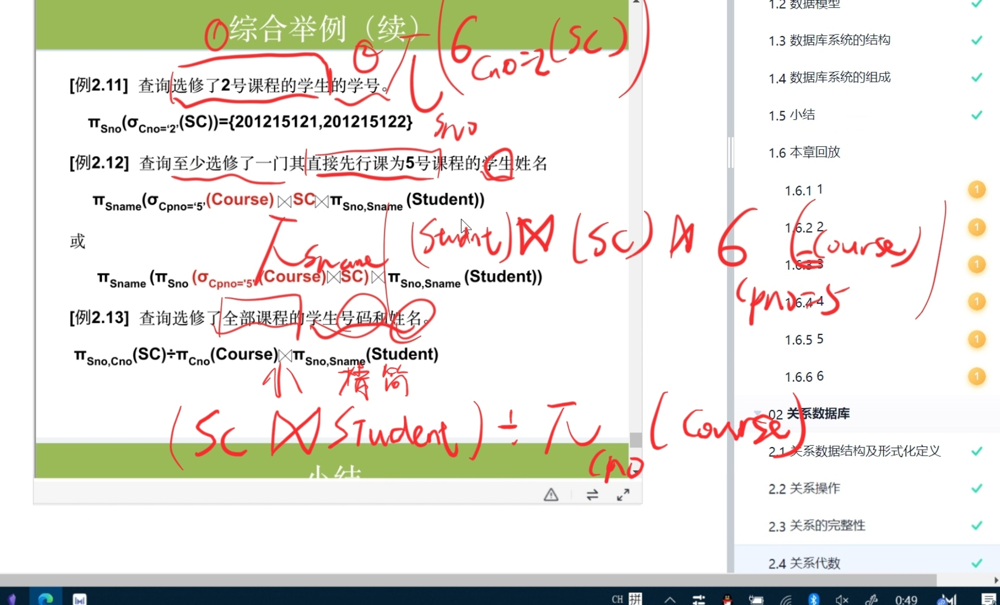

# 关系代数运算符

## 集合运算
### 并
### 交
### 差
### 笛卡尔积

## 关系运算
### 基础知识
$$
R(A_{1},A_{2},A_{3}) , 
t \in R ,
t[A_{1}],
t[A]

$$
- **象集**：类似值域的东西，
🐱有关系R(X,Z),$Z_{x1}$即当X=x1是的Z的值域

### 选择
在关系R中选使F为真的**元组**

### 投影
选择若干属性**列**

### 连接
- 从两个关系的笛卡尔集中选择一些元组

- **等值连接**:选取A,B属性相等的元组

- **自然连接**:去除重复属性列,会删除**悬浮元组**

- **外连接**:保留悬浮元组(含有null)

### 除
- 同时从行和列角度
- R(X,Y)➗S(Y,Z)的结果是**只有X列**的元组,该元组所在的R关系的元组要能够将S关系中的**所有**元组消去.
- 常见于**至少选择**被除关系的某些属性

- 

# 综合举例

- 至少要投影选择一些列
