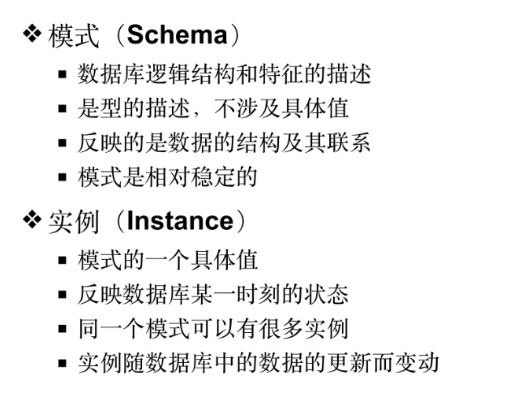
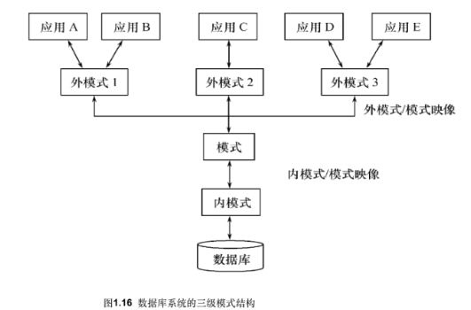
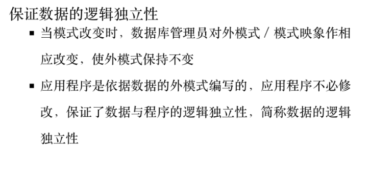
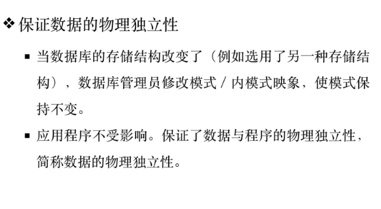

# 概念与重点⭐

什么叫逻辑独立性
****
什么叫物理独立性

# 三级模式
数据的三种抽象层级

## 外模式
==局部==

## 模式
> PostgreSQL 模式（SCHEMA）可以看着是一个表的集合。
> 一个模式可以包含视图、索引、数据类型、函数和操作符等。
> 相同的对象名称可以被用于不同的模式中而不会出现冲突，例如 schema1 和 myschema 都可以包含名为 mytable 的表。

## 内模式

# 两级映射
三级模式间的联系与转换
## 外模式/模式

保证数据的**逻辑独立性**
逻辑独立性即:应用程序时根据数据的外模式编写的,而**模式改变**时,数据库管理员可以通过对外模式/模式映像做相应更改,使外模式保持不变,从而使应用程序不必修改,保证**数据与应用**的逻辑独立性.
  ^nb2hby

## 模式/内模式

保证数据的物理独立性
物理独立性即:当数据库的**存储结构改变**了,数据库管理员通过修改**模式/内模式**映像,使模式保持不变,应用程序不受影响,保证了**数据与程序**的物理独立性.
 ^3pjvk5
