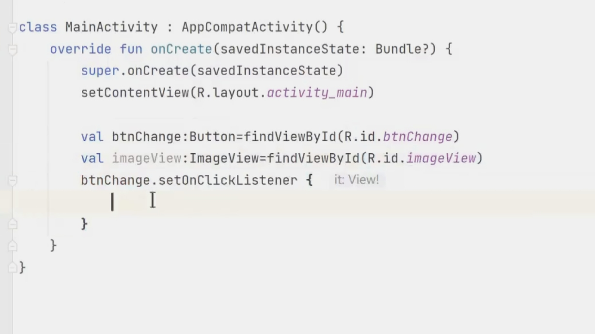

# 控件注意
依靠约束而不是拖动
资源名都有小写
最后都生成存在了R.java中
# imageview
名字必须是全英文
scaleType
glade开源组件,从网上
OKhttp控件拉下或上传图片

添加矢量图
点击添加vector asset

## 开源控件-clrcleimageview
1. gradle中添加引用
2. xml文件中添加clrcleimageview控件

# 菜单menu
1. 添加new resource directory
2. 选择menu type
3. 拖动几个menu item
4. 重写方法oncreateoptionmenu
menuinflater.inflate(mymenu,menu)
5.**重写方法onoptionselected**
点击不同按钮,输出不同文本
.jpg)
