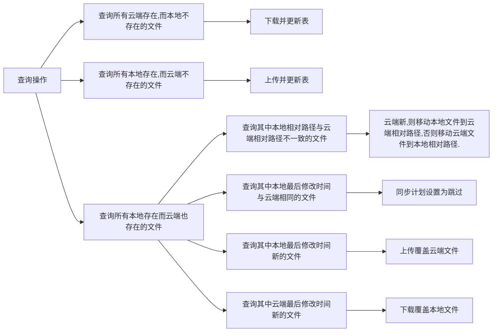

### 一个潜在的示例
"我的手机.md": {
      "key": "我的手机.md",
      "existRemote": true,
      "mtimeRemote": 1650089293715,
      "mtimeRemoteFmt": "2022-06-16T14:08:13+08:00",
      "sizeRemote": 12,
      "remoteEncryptedKey": "我的手机.md",
      "changeRemoteMtimeUsingMapping": true,
      "existLocal": true,
      "mtimeLocal": 1650089293715,
      "mtimeLocalFmt": "2022-06-16T14:08:13+08:00",
      "sizeLocal": 12,
      "decision": "skipUploading",
      "decisionBranch": 1
    }

## 新思路
1. 每一个用户，在本地维护一张表，当应用打开后动态维护，目的是减少遍历文件的次数       保存：用户id,文件的本地相对路径（本地云端是一致的）(作为主码)，本地是否存在，本地最后修改时间，文件名，云端是否存在，**文件**的云端相对路径,云端最后修改时间，同步计划（上传，下载，跳过,移动,删除）
2. **第一次打开应用**，扫描本地所有文件，更新表，扫描云端文件，更新表。
3. **如果文件发生修改**：本地表查询该文件,更新**文件**的本地最后修改时间等
4.  **如果文件发生移动**:本地表查询该文件,更新**文件**的本地相对路径等
5. **如果文件移入回收站**:找到该文件,更新**文件**的本地相对路径为回收站
6. **点击同步**，按照如下策略开始同步

- 遍历本地文件，保存到表中
- 遍历云端文件[[遍历云端文件]]
- [gotev/android-upload-service: Easily upload files (Multipart/Binary/FTP out of the box) in the background with progress notification. Support for persistent upload requests, customizations and custom plugins. (github.com)](https://github.com/gotev/android-upload-service)[[文件上传]]
- 去除首个斜杠
- [[sql实践]]
- bug:多协程的问题[(48条消息) Kotlin协程 - - - 协程的简单使用_m0_47914176的博客-CSDN博客_kotlin协程使用](https://blog.csdn.net/m0_47914176/article/details/122921812)[[kotlin协程]]
- [[文件下载]]
- 