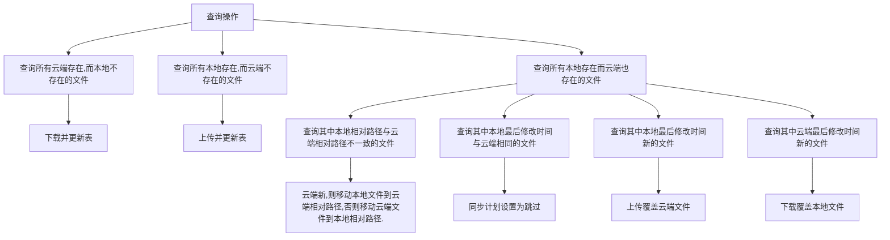

# 上传与下载
[android-upload-service/examples/server-nodejs at master · gotev/android-upload-service (github.com)](https://github.com/gotev/android-upload-service/blob/master/examples/server-nodejs/index.js)

# 云存储
### 一个潜在的示例
"科研/盲人找路/我们的工作.assets/image-20220419012920278.png": {
      "key": "科研/盲人找路/我们的工作.assets/image-20220419012920278.png",
      "existRemote": true,
      "mtimeRemote": 1650478247043,
      "mtimeRemoteFmt": "2022-04-21T02:10:47+08:00",
      "sizeRemote": 49590,
      "remoteEncryptedKey": "科研/盲人找路/我们的工作.assets/image-20220419012920278.png",
      "changeRemoteMtimeUsingMapping": false,
      "existLocal": true,
      "mtimeLocal": 1650478247043,
      "mtimeLocalFmt": "2022-04-21T02:10:47+08:00",
      "sizeLocal": 49590,
      "decision": "skipUploading",
      "decisionBranch": 1
    },
## 思路
- 每一个用户，本地与云端维护一张表
保存：本地**所有文件**的路径，本地最后修改时间，文件名，云端最后修改时间
- **第一次打开应用**，扫描本地所有文件，更新本地表，扫描云端文件，更新云端表。
- 如果**点击同步**
- 扫描云端表，如果文件云端存在，本地不存在，进行下载到本地。如果文件云端存在，本地也存在，比较云端与本地文件的最后修改时间，如果云端更新，下载到本地
- 再扫描本地文件
- 扫描本地文件，如果云端表中不存在，直接上传，自动写入云端表。如果云端存在，比较云端与本地文件的最后修改时间，如果两者相同，不上传，如果本地更新，覆盖云端文件，更新云端表，如果云端更新，下载到本地。
- 什么时候云端删除:"在回收站"属性为true
- **如果文件发生修改**：更新本地表
- **如果添加文件，删除文件**：更新本地表🌅本地删除了的文件，如果同步，也会从云端再次下载
- 如果**本地文件发生移动**：导致一个key,本地存在，云端不存在，一个key云端存在，本地不存在
- **是否需要云端表**：似乎不需要，可以将本地表和云端表整合在一切
- 
  
## 新思路
1. 每一个用户，在本地维护一张表，当应用打开后动态维护，目的是减少遍历文件的次数       保存：**文件**的本地相对路径（本地云端是一致的）(作为主码)，本地是否存在，本地最后修改时间，文件名，云端是否存在，**文件**的云端相对路径,云端最后修改时间，同步计划（上传，下载，跳过,移动,删除）
2. **第一次打开应用**，扫描本地所有文件，更新表，扫描云端文件，更新表。
3. **如果文件发生修改**：本地表查询该文件,更新**文件**的本地最后修改时间等
4.  **如果文件发生移动**:本地表查询该文件,更新**文件**的本地相对路径等
5. **如果文件移入回收站**:找到该文件,更新**文件**的本地相对路径为回收站
6. **点击同步**，按照如下策略开始同步

[[云同步]]

