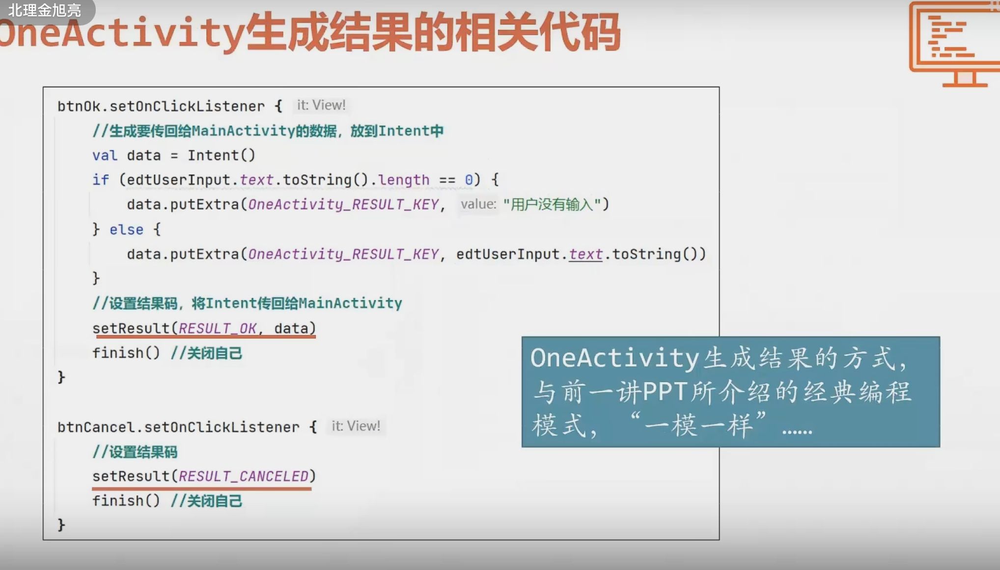

[[fragment]]
[[jetpack]]

# kotlin
[核心-kotlin](../核心-kotlin.md)
# 编程访问Android控件
## Activity
View:所有控件派生自它
Viewgroup:能包容其他控件
Layout:布局
## 关系
XML中所有元素对应一个对象(JAVA或Kotlin中),每个对象会自动给每个成员编号(根据id),最后都生成存在了R.java中


## 消除findviewbyid(麻烦)
### 视图绑定(view Binding)

### 数据绑定库(MVVM使用)

## 课中所讲一些控件
[UI](UI.md)

# 界面布局基础
不用太多嵌套
控件树
## 盒子模型
Margin(控件间)
padding(控件内)


---

固定
wrap_content:依照显示具体内容,常用按钮与textview
match_parent:同父控件一致

---
## 布局单位
像素单位不合适
设备无关像素dp,指定宽高
文本用sp
颜色选用标准颜色
color.xml设置颜色,xml中调用@color/...


# 万能布局-constraintlayout
外部库的控件(名字长)
### constraint
至少要有两个约束
- 水平
- 垂直

是wrapcontent

# activity与其生命周期
## 回调函数


传一个接口,回调接口的实现重写函数
通过传入不同的回调函数实现在运行一段代码之后,再运行不同的代码

## activity的存亡过程

Oncreate等


显示新界面时,老界面自动onstop
整个退出后 mainactivaty onstop,ondestory
-->关于后台下载
在onstop与onstart

旋转,被认为是配置改变,**销毁再重建activity**
onsaveinstancestate在销毁时会自动调用
Bundle类型负责存储信息
```
private var counter=0
override  fun onsaveinstancestate(outstate:Bundle)
{
super.onsaveinstancestate(outstate:Bundle)
//保存实例数据
outstate.putint("counter",counter)
}

```

数据残留:退出后静态变量短暂保留

# 多activity
注意所有activity需要在清单文件注册
## activity之间的信息交换a-保存传送接收

### 保存

### 传递

### 接收
 
## activity之间的信息交换b-请求传递
#### 旧的
A-->B
打开:
请求码:一个activity可能请求打开多个activity
接收:
重写onactivityresult(被废弃)
被打开的activity中setactivity(结果码,data)
注意finish
结果码 :
#### 基于回调的(新)⭐
##### 启动者

启动一个activity时定义launcher对象与相应的回调代码

一个launcher对象对应一个activity-->没有请求码只有结果码
启动器在合适的时间接收一个intent对象,不再start activity


##### 接收者(不变)

##### 自定义协议
自己定义传什么,返回什么

## 回退堆栈(回退键的实现)
看到的是栈顶
同一个activity可能有多个记录
## activity的启动模式
使用清单文件


只有复杂程度很高的使用:

## 多activity管理
### 父子activity

### 调用操作系统

[[../核心-kotlin]]实例对象
### 默认启动activity


# intent
## 概念


启动activity


响应哪些intent


## 选择图片示例


# 关于权限


