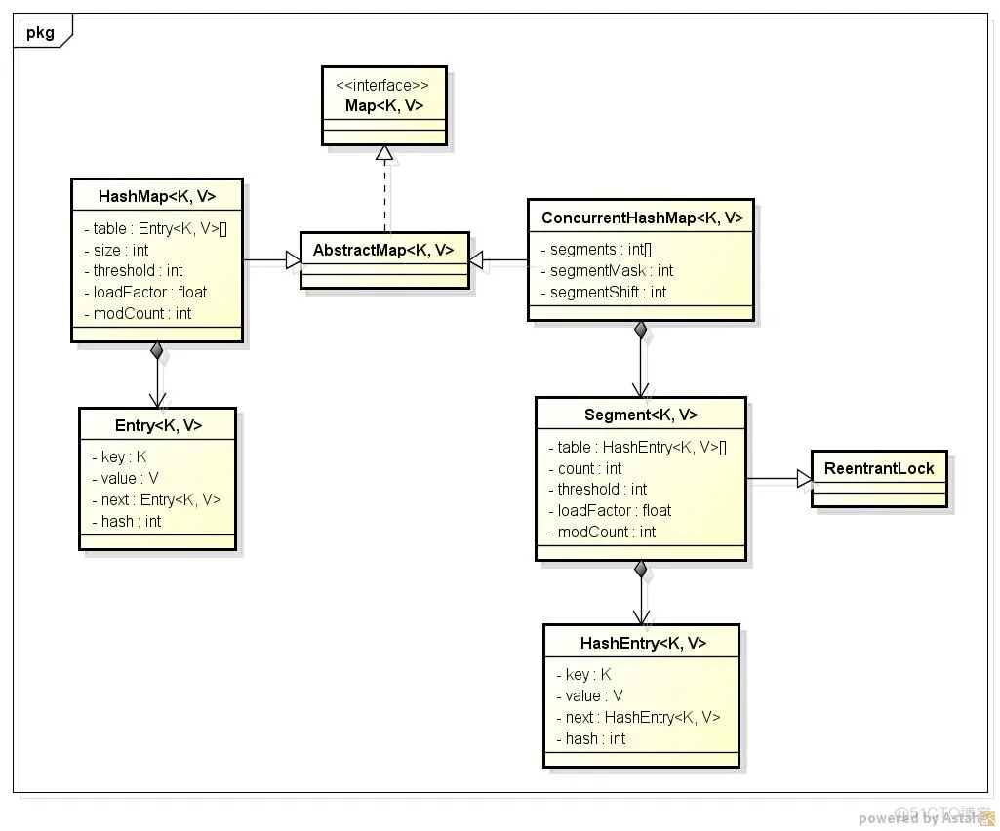

# 相同点
- HashMap, ConcurrentHashMap和Hashtable是Java中三种用于存储键值对的数据结构
# 不同点
- HashMap
	- 线程不安全
	- 可以接受为null的键值(key)和值(value),但只有一个
	- 实现了Map接口
	- 初始size为16，扩容：$newsize = oldsize*2$，size一定为2的n次幂
	- 单一线程下HashMap性能要好过Hashtable。
	-  HashMap会将链表长度大于阈值是**转化为红黑树**（会先判断当前数组的长度是否小于 64，是则扩容，而不转化），将链表转化为红黑树，以减少搜索时间
- **Hashtable**
	- 线程安全
		- [[synchronized 作用与使用方法]]
	- 不能接受null值，会产生空指针异常。
	- 实现了Map接口,基于Dictionary抽象类
	- 底层数组+链表实现,一次锁住**整个hash表**
	- 初始size为11，扩容：$newsize = olesize*2+1$
	- HashMap和Hashtable默认的“负载极限”为0.75,到达负载极限后hash表会发生rehashing
- **ConcurrentHashMap**
	- 线程安全
	- 可以接受为null的键值(key)和值(value)
	- 实现了Map接口
	- 底层采用**分段**的数组+链表实现,把整个Map分为N个Segment,一次锁住**一个桶**
	- 默认的“负载极限”为0.75,到达负载极限后**该段**会发生rehashing扩容,不会对整个Map进行扩容
	- ConcurrentHashMap的**并发性更高**，因为它使用了分段锁定技术，使得不同线程可以同时访问不同的段。
# 类图
