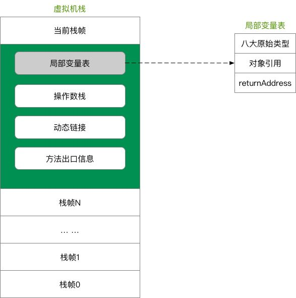

# JVM 内存结构
Java 虚拟机的内存空间分为 5 个部分：
https://github.com/doocs/jvm/blob/main/docs/01-jvm-memory-structure.md
## 程序计数器
- 是当前线程正在执行的那条字节码指令的地址
	- 字节码解释器通过改变程序计数器来依次读取指令，从而**实现代码的流程控制**
- 每条线程都有自己的程序计数器
- 随着线程的创建而创建，随着线程的结束而销毁。
- 唯一一个不会出现 `OutOfMemoryError` 的内存区域
## Java 虚拟机栈
- 描述 Java 方法运行过程的内存模型,JVM为每一个即将运行的 Java 方法创建一块叫做“栈帧”的区域，用于存放该方法运行过程中的一些信息
- 

## 本地方法栈(C栈)
- 为 JVM 运行 Native 方法准备的空间
## 堆
- 用来存放对象的内存空间，**几乎所有的对象都存储在堆中**
- 线程共享，整个 Java 虚拟机**只有一个堆**，所有的线程都访问同一个堆。
	- 而程序计数器、Java 虚拟机栈、本地方法栈都是一个线程对应一个。
- 在虚拟机启动时创建,是垃圾回收的主要场所
- 堆可分为**新生代**（Eden 区：`From Survior`，`To Survivor`）、**老年代**
	- Java 中的堆也是 GC 收集垃圾的主要区域。GC 分为两种：**Minor GC、Full GC ( 或称为 Major GC )**。
	- [[GC堆中的新生代和老年代]]
## 方法区(永久代)
- Java 虚拟机规范中定义方法区是堆的一个逻辑部分。方法区存放以下信息：
	-   已经被虚拟机加载的类信息
	-   常量
	-   静态变量
	-   即时编译器编译后的代码
- 方法区是堆的一个逻辑部分，因此和堆一样，都是**线程共享**的。整个虚拟机中只有一个方法区
- 方法区中的信息一般需要长期存在，而且它又是堆的逻辑分区，因此用堆的划分方法，把方法区称为“永久代”
## 直接内存
- 直接内存是除 Java 虚拟机之外的内存，但也可能被 Java 使用。
- 