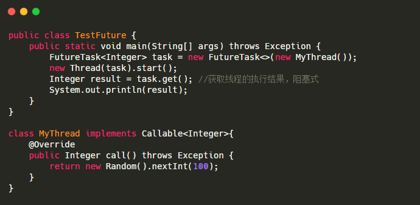

使用 Callable 和 Future：首先定义一个 Callable 的实现类，并实现 call 方法。call 方法是带返回值的.然后通过 FutureTask 的构造方法，把这个 Callable 实现类传进去.把 FutureTask 作为 Thread 类的 target ，创建 Thread 线程对象.**通过 FutureTask 的 get 方法获取线程的执行结果**
    