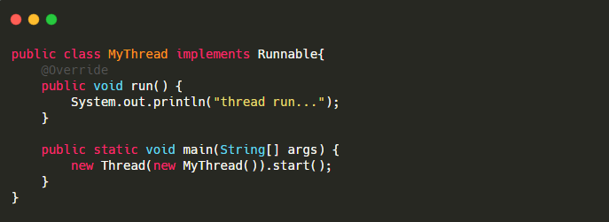
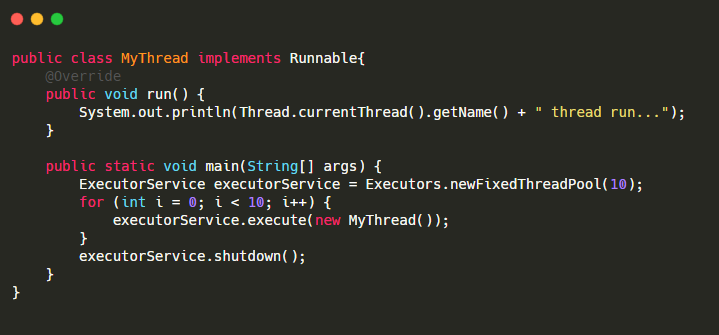
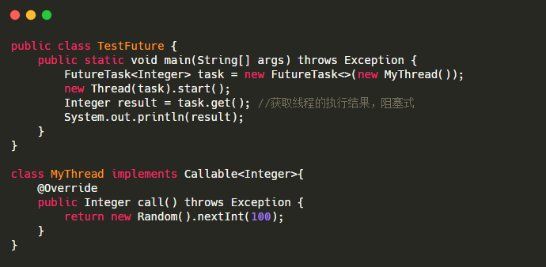

1.  继承 Thread 类：继承 Thread 类，重写它的 run() 方法，并创建新线程对象，调用 start() 方法来启动新线程。
    
2.  实现 Runnable 接口：实现 Runnable 接口，重写它的 run() 方法，并创建新线程对象，调用 start() 方法来启动新线程。
    
3.  使用 Executor 框架：使用 Executor 框架创建线程池，将 **Runnable 对象**提交到线程池中运行。
    
4.  使用 Callable 和 Future：首先定义一个 Callable 的实现类，并实现 call 方法。call 方法是带返回值的.然后通过 FutureTask 的构造方法，把这个 Callable 实现类传进去.把 FutureTask 作为 Thread 类的 target ，创建 Thread 线程对象.**通过 FutureTask 的 get 方法获取线程的执行结果**
    
