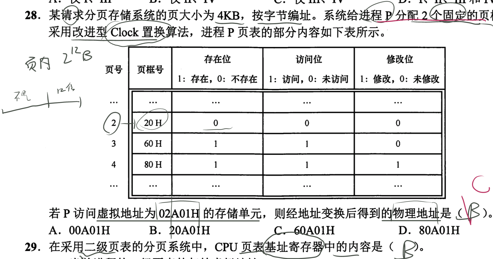

## 页表-记录进程的页面和内存块间的映射关系的表
- **页表的产生原因**
	- 为了能知道**进程的每个页面在内存中存放的位置**，操作系统要为==每个进程建立一张页表。== #注意 #z408 
	- 
		- 如本题中可见有该进程已经调入内存了2个页面,需要进行置换
- **页表的存放地点**
	- 页表通常存在==PCB==（进程控制块）中 #注意
	- 进程的页表驻留在==内存==中,当执行时将**页表首地址**和**页表长度数据**装入==页表寄存器==
- **页表的内容**
	- 页表记录**进程页面**和**实际存放的内存块**之间的**映射关系**
- **页表与页表项**
	- 一个**进程**对应一张**页表** #注意
	- 进程的每个**页面**对应一个**页表项**
	- 每个**页表项**由“**页号**”和“**块号**”组成
	- 每个页表项的长度是相同的
	- **块号的位数**
		- 计算机中**内存块的数量**-->页表项中块号至少占多少字节 #注意
		- 
	- **页号的位数**
		- 页表项连续存放，因此页号 可以是隐含的，不占存储空 间（类比数组)
		- 
		- 页表中的页号可以是**隐含的**，即页号不占用存储空间 #注意
	- **页表项存放地址的计算**
		- 如果每个页表项占3B
			- 即块号的位数的大小
		- **存放页表项的页内碎片** #注意
			- 
		- 理论上，页表项长度为 3B 即可表示内存块号的范围，但是，为了方便页表的查询， 常常会让一个页表项占更多的字节，**使得每个页面恰好可以装得下整数个页表项**
	- **内存块的起始地址的计算**
		- 页表记录的只是==内存块号==，而不是内存块的起始地址 #注意
		- J 号内存块的起始地址 = J * 内存块大小
	- 
%%[🖋 Edit in Excalidraw](attachments/%E5%9F%BA%E6%9C%AC%E5%88%86%E9%A1%B5%E5%AD%98%E5%82%A8%E7%AE%A1%E7%90%86%202022-09-26%2021.46.53.excalidraw.md)%%