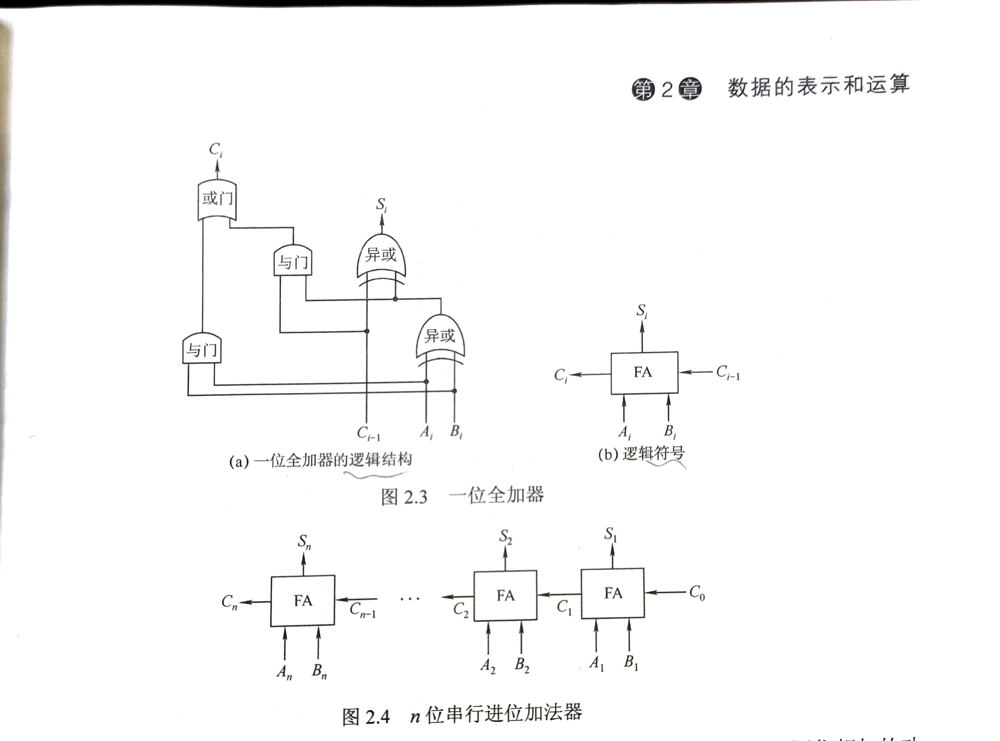

### 串行进位加法器

- **串行进位加法器**是把n个全加器相连可得到n位加法器,每级进位直接依赖于前一级的进位.
- :cat:好多个一位全加器串一起
- 最长运算时间决定于进位信号的传递时间(**因此需要加快进位的产生和提高传递的速度),**位数越高,其传递时间越长.全加器本身的求和延迟只是次要因素.
- 如图实现了n位加法器,**实际是模$2^n$的加法运算**,即位数有限,高位自动丢失
- 