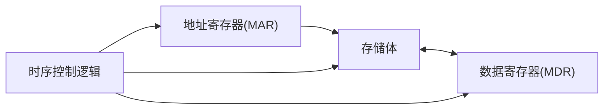

### 冯诺依曼机

#### Tips

- **存储程序**
	- (程序+数据)-->主存后自动执行
	- 指令与数据**以同种地位**,用**二进制代码**存储在存储器中
		- 指令:操作码(操作类型)+地址码(操作数的地址)
- **程序控制**
	- 基本工作方式是**控制流驱动方式**
- **基本特点**
	- 按地址访问并顺序执行指令
- **组成**
	- 运算器,存储器,控制器,输入设备,输出设备
- **关于寄存器**:
	- [[CPU内部寄存器的类别-用户可见用户不可见]]
#### 存储器
- 分类：主存储器（内存储器）与辅助存储器（外存储器）
- 主存储器：按地址存取，CPU能直接访问
- 外存储器：信息必须调入主存才能访问
- 主存储器逻辑：

- **地址寄存器(MAR)**:存放欲访问的访存**地址**,经过地址译码找到存储单元,位数对应存储单元的个数,即10位对应$2^{10}$个存储单元,MAR长度与PC长度相等,**在CPU中但未集成到运算器与控制器中**
- **数据寄存器(MDR)**:暂存要从存储区中读或写的**数据**，位数是==存储字长==. #z408 
- **存储体**:若干存储单元组成,存储单元的二进制代码是**存储字**,其位数是**存储字长**,**存储字长**是1B(8bit)的**偶数倍**
- MAR与MDR存在于CPU中
- **地址译码器**：CPU输出一个存储器地址到地址总线上，这个地址怎样才能选中一个存储单元，这就是地址译码器要解决的问题。
- **相联存储器(CAM)**:既可按地址寻址又可**按内容**(一部分)寻址
	- 也称为按内容访问存储器（content addressed memory)

#### 运算器
- 进行算数运算与逻辑运算
- 核心:**算术逻辑单元(arithmetic and logical unit,ALU)**
- 包含若干寄存器,用于暂存操作数和中间结果
- 必须具备的3个寄存器:累加器(ACC),乘商寄存器(MQ),操作数寄存器(X)
- 程序状态寄存器(也称标志寄存器)(PSW/PSWR):存放结果是否溢出等标志信息
#### 控制器
- 组成:程序计数器( program counter,**PC**),指令寄存器(instruction register,**IR**),控制单元(control unit,**CU**)
- PC：存放**下一条指令**的**地址**，可以自动加１，**与MAR有之间通路**🌅
- IR:存放当前欲执行**指令**,内容来自**MDR**,指令中的操作数(operand) OP(IR)送往**CU**,地址码Ad(IR)送往**MAR**,用于去操作数
- 中央处理器CPU:运算器与控制器集成到同一个芯片
- 主机:CPU+主存
- 外设:除主机外的硬件设备
#### 总线
- CPU与主存通过总线相连
- 总线的三组信号线:**地址,控制,数据**
- 控制线中有读/写线,指出是读到CPU还是写到主存
- 总线传送周期:
	- **一般指CPU通过总线和存储器或I/O接口进行一次数据传输所需要的时间**
	- 包括（主设备）申请分配、寻址（找从设备）、传送数据、结束（撤销）四个阶段
	- 一般存取周期>总线周期>存取时间