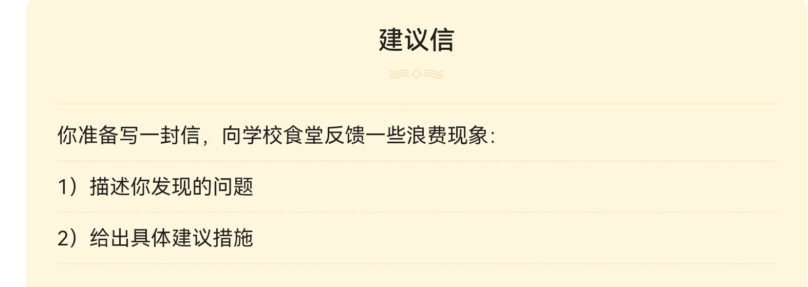

- **称呼**(致相关人士)
	- `To Whom It May Concern,`  (写给不知道姓名的人)
	- #注意 以逗号结尾
- **正文**
	- **自我介绍**(可有可无)
		- `I am a student in the Department of History`
			- Department介词是in
		-  `I am a student in the Department of History at Peking University`
			- 校名前用At
	- **写信目的**
		- I have some suggestions **as to** XX问题
		- `Meanwhile,I have some suggestions as to the problem of food waste at college cafeteria`
			- **as to/** on #注意 关于
			- at college **cafeteria**
			- Meanwhile
	- **先委婉感谢**
		- `As a student who eat the cafetaria everyday,I would first like to take this opportunity to express my appreciation to cafeteria staff`
			- as a.... 我建议的立场
			- take this opportunity 借此机会 
			- express my appreciation 表达感谢 #注意
	- **我注意到...,其原因是**
		- `I noticed that many foods are offered in large portions, as a result of which quite a number of students leave half their food uneaten.`
		- `i noticed that....,as a result of which` #注意 过去式,which指代notice的现象
		- `leave half their food uneaten` 剩下一半没吃过的
	- **出于这个原因,我提议...,这样就能...**
		- `For this reason, I propose offering smaller portions so that we can avoid unnecessary waste.`
		- propose **doing** sth #注意 
		- so that we can..
	- **此外,...可能是有帮助的**
		- `In addition, it would be helpful to set up signs encouraging students not to waste food.`
		- it would be helpful to
		- **signs** encouraging students not to waste food. #注意
- **结尾客套话**
	- 谢谢你的时间
		- `Thank you for your time`
	- 希望你认为这些建议实用
		- `I hope you find these suggestions practical.`
		- find ...practical
- **落款**(最后一行最右边)
	- `Yours Sincerely/faithfully`
	- #注意  yours ,知道姓名用Sincerely,不知道姓名用faithfully <!--SR:!2022-10-15,3,250!2022-10-15,3,250!2022-10-15,3,250!2022-10-15,3,250!2022-10-15,3,250!2022-10-15,3,250-->

